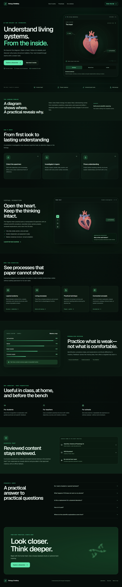

# Biology Entelloq

Biology Entelloq is an investigation-first biology learning environment. Learners can orient a specimen, inspect it in an accessible atlas or interactive 3D, open anatomical layers, explain relationships, practise in sequence, and finish with a viva.



## Run locally

Requirements: Node.js 20 or newer and npm.

```powershell
npm install
npm run dev
```

Open [http://localhost:3000](http://localhost:3000). The complete core experience is free and works without credentials. Hand tracking is optional and runs locally in the browser after permission is granted.

The instructor always has a grounded local response path. To opt into remote free-form responses, set `ANTHROPIC_API_KEY` in `.env.local`; usage and billing are then governed by that provider.

## Quality commands

```powershell
npm run lint
npm run typecheck
npm test
npm run test:e2e
npm run build
```

Install Playwright's browser once on a new machine with `npx playwright install chromium`.

## Documentation

- [Dark-green design update and publishing status](docs/DARK_DESIGN_UPDATE.md)
- [Implementation and measured performance](docs/IMPLEMENTATION_REPORT.md)
- [Add a specimen](docs/ADDING_A_SPECIMEN.md)
- [Asset licences and educational sources](docs/ASSET_LICENSES.md)
- [Generated product screenshots](docs/screenshots/README.md)
